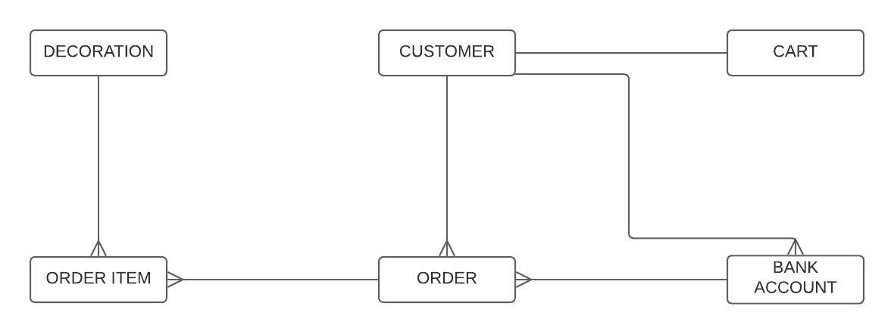

# Online homemade store application made with Java and Spring Boot. 

This application allows CRUD operations on Decoration, Order, OrderItem, Customer, Cart and BankAccount entities through requests to API endpoints. APIs are documented with Swagger and tested using JUnit5 and Mockito.

Endpoints:
 
* Add a new customer 
* Get all customers
* Search customer by id 

 

* See all decorations
* Get decorations from a specific category(MARCH, EASTER, CHRISTMAS)
* Add a new decoration in the store
* Edit information about a decoration from the store
* Search decoration by id

 

* Add an existing decoration from the shopping cart(with a specific quantity)
* Delete a decoration from the shopping cart
* Search a customer's cart by id
* Get all carts from the database

 

* Place an order for a customer
* Search an order by id
* See all orders from a specific client 

 

* See all order items from an order
 
 

* Add new bank account for a specific customer
* Get all bank accounts for a specific customer
* Delete a bank account for a specific customer

 

The main 5 features for the MVP would refer to the ability to add new customers, to visualize all decorations, to add decorations in the shopping cart, to delete decorations from the cart and to place a new order. 

 

Database ERD:
 

